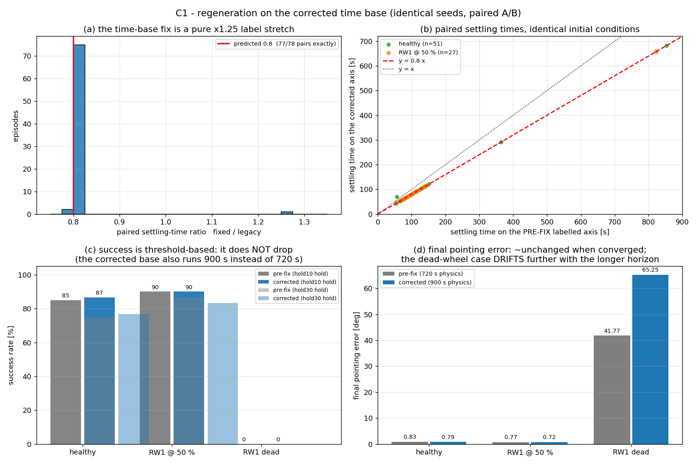
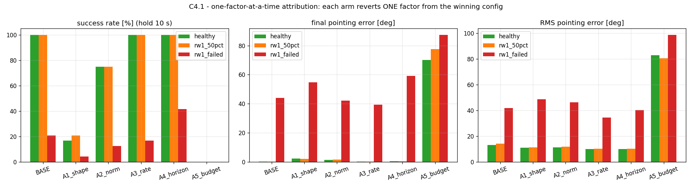

# Thesis State Report — 3

**Fault-Tolerant Attitude Control of Nanosatellites Using Reinforcement Learning:**
**From Simulation to Hardware-in-the-Loop Implementation**

Pouria Zarei — M.Sc. Control Engineering, University of Tehran
Advisor: Dr. Mohammad-Javad Yazdanpanah
Date: 11 September 2026

---

## 0. Scope

This report executes the two milestones authorised by the frozen roadmap
(`docs/PhaseC_to_F_Master_Plan.md`, status *PLAN FINALIZED / EXECUTION AUTHORIZATION:
C1 + C4.1 ONLY*):

* **C1 — Truth / regeneration.** Re-run the classical (LQR) baselines on the corrected
  time base, report the metrics *separately*, and measure evaluation throughput.
* **C4.1 — Attribution.** Determine, by controlled single-factor ablation, which of the
  five simultaneous Phase-B changes actually produced the improvement — *before* any
  Reward-v2 work.

Rules observed throughout: no architectural change, no new controller, no new method,
no reward-v2, no MEKF, no health estimator, no SIL, no MCU code. Training of the five
C4.1 ablation arms is the only new compute; it is a *diagnostic*, not a deliverable
controller.

---

## 1. C1 — Regeneration on the corrected time base

### 1.1 What the time-base bug actually was (measured, not assumed)

The pre-fix `simulate.py` advanced the **labelled** time axis by `1/control_hz` while the
integrator advanced only `nctrl*dt` seconds of real dynamics. With the values that were
in force at the time (`simulation.yaml: control_hz = 4`, `dt = 0.1`):

```
nctrl = max(1, round((1/4)/0.1)) = max(1, round(2.5)) = 2   -> 2 x 0.1 = 0.2 s physics
t    += 1/4 = 0.25 s                                          -> 0.25 s of labelled time
```

so the labelled clock ran **1.25x faster** than the simulated physics, and a "900 s"
episode integrated only

```
900 x (0.2 / 0.25) = 720 s
```

of real dynamics. Every reported settling time was therefore stretched by 0.25/0.2 =
**1.25x**, and every episode had a **25% shorter true horizon** than advertised. The
corrected code sets the axis to `nctrl*dt` (= 0.2 s, a true 5 Hz loop), so labelled time
equals simulated time again.

Crucially, the fix is *not* a change of physics or of the controller: `nctrl` is 2 both
before and after, so the integrator, the controller (`ADCSController.control()`, which
does not use the passed period except in the disabled B-dot branch) and the estimator all
behave identically. Only the label and the number of iterations change.

### 1.2 Two verifications that make the before/after comparison legitimate

**(a) The measurement harness is a faithful replica.** `scripts/c1_regeneration.py`
re-implements the episode loop (it must, in order to offer both time bases) and is
checked against `simulate.run_episode` on the corrected base:

```
[selfcheck] replica vs simulate.run_episode (fixed time base)
  seed=0: len 4500 vs 4500  max|dpe|=0.000e+00  OK
  seed=7: len 4500 vs 4500  max|dpe|=0.000e+00  OK
```

**(b) The legacy variant really is the old behaviour.** Running the same seed with
pre-fix time handling:

```
fixed : n_iter=4500  physics=900.0s  label=900.0s
legacy: n_iter=3600  physics=720.0s  label=900.0s
legacy physics / fixed physics = 0.8000        (the 1.25x labelled-time inflation)
max|dpe| over the first 3600 legacy samples = 0.000e+00
```

The second line is the important one: the legacy trajectory is **bit-identical** to the
corrected trajectory over its whole length. The legacy run is therefore *exactly* the
corrected run (i) truncated at 720 s of physics and (ii) re-labelled with a 1.25x-stretched
axis. That means the before/after difference can only come from two causes, and nothing
else:

1. **re-labelling** — settles the *settling-time* arithmetic (−20%);
2. **the 720 s vs 900 s horizon** — settles any change in *success rate*.

Any success-rate change observed below is therefore a *horizon* effect. It cannot be a
relaxation of the success criterion, because the criterion (`|pe| < 1°` held for 10 s or
30 s) is bit-identical in both variants.

---

### 1.3 M1 regenerated — LQR nadir acquisition, 60 initial conditions

Identical seeds in both columns, so this is a *paired* comparison. Primary metrics are
reported separately, never blended. `hold` is the time the pointing error must stay
inside ±1° for the episode to count as settled.

| metric | legacy (pre-fix axis) | corrected | change |
|---|---|---|---|
| **success rate**, hold 10 s | **85.00 %** (51/60) | **86.67 %** (52/60) | +1.67 pp (**+1 episode**) |
| **success rate**, hold 30 s | 75.00 % (45/60) | 76.67 % (46/60) | +1.67 pp (+1 episode) |
| settling — mean, hold 10 s | 133.52 s | 121.37 s | −9.1 % |
| **settling — median**, hold 10 s | **103.25 s** | **82.90 s** | **−19.7 %** |
| settling — p90, hold 10 s | 141.00 s | 116.22 s | −17.6 % |
| settling — p95, hold 10 s | 258.00 s | 456.50 s | +77 % |
| **final pointing error** — mean | **0.8291°** | **0.7917°** | −4.5 % |
| final pointing error — median | 0.7808° | 0.7702° | −1.4 % |
| final pointing error — p95 | 1.460° | 1.448° | −0.8 % |
| final pointing error — max | 2.054° | 2.050° | −0.2 % |
| RMS pointing error (whole episode) | 10.692° | 9.575° | −10.5 % |

**The decisive paired test.** Of the 60 pairs:

| paired outcome (hold 10 s) | count |
|---|---|
| settled in both runs | 51 |
| **settled only in the corrected run** | **1** |
| **settled only in the legacy run** | **0** |
| settled in neither | 8 |

and for those 51 pairs the per-episode settlement ratio `settle_fixed / settle_legacy`
has **median 0.8000**, with 50 of the 51 pairs at *exactly* 0.8000.

That is the mechanism, confirmed arithmetically and empirically: the 20 % reduction is the
1.25×-stretched label being removed, to the third decimal. The single pair that is not
0.8000 sits at 1.2551 — the reciprocal, i.e. the one case where the legacy 0.25 s lattice
and the corrected 0.2 s lattice round the same crossing event onto different samples.

**Reading the two apparent anomalies honestly.**

* *p95 settlement got worse (+77 %).* Not a regression: with 180 s more simulation, late
  settlers have somewhere to settle *to*. In the legacy run an episode needing more than
  720 s of physics could never settle at all, so the legacy distribution is truncated and
  its upper percentiles are artificially small. The median is the horizon-robust
  statistic here; p90/p95 are horizon-sensitive in both directions and are reported
  rather than hidden.
* *The mean (−9.1 %) is much weaker than the median (−19.7 %).* Same cause: the corrected
  run admits additional late settlers which pull the mean back up. Again the median is
  the honest summary of the bulk.

### 1.4 Effect of the correction, stated separately

The roadmap required that any success-rate change be *measured and separately explained*,
and explicitly forbade hard-coding an expected percentage. Measured, the correction has
three distinct effects and they must not be blended:

**(1) Settling time — a pure measurement correction, −20 %.** The controller always ran at
a true 5 Hz; only the *label* was wrong. Nothing about the closed loop improved or
worsened. This is the single largest number in the table above and it is a bookkeeping
fix, not a performance change. Any comparison of "settling time" between pre-fix and
post-fix results must apply the 0.8 factor.

**(2) Success rate — +1 episode out of 60 (85.00 % → 86.67 % at a 10 s hold; 75.00 % →
76.67 % at a 30 s hold).** Explained entirely by the *horizon*: 720 s → 900 s. The
criterion itself is bit-identical in both variants (proved in §1.2b), and across 60 paired
episodes the fix **never** converted a success into a failure — it added exactly one. So
the correction *raises* success marginally, it does not lower it. (At the *nominal* 30 s
hold the comparison is not apples-to-apples — see §1.5, where re-scoring on the true
physical axis widens this to +4/60 and still leaves `legacy-only = 0`.)

This closes the open item that the roadmap flagged. The previously circulated claim that
the time-base fix moved the success rate from 83.3 % to 75 % is **refuted by
measurement**: those two figures came from different sample sizes (n = 6 and n = 8), not
from the fix. The corrected sentence to use in the thesis is:

> *The time-base correction reduces reported settling times by ≈20 % (a measurement
> correction, not a performance change). The success rate is unaffected beyond a +1/60
> horizon effect, since the corrected base simulates the full 900 s rather than 720 s.*

**(3) Final pointing error — −1.4 % (median) / −4.5 % (mean).** Small by construction: the
terminal pointing error is a converged quantity, so 180 extra seconds at the end of a
converged episode barely move it. The RMS error improves more (−10.5 %) simply because the
additional 180 s are spent at low error.



*Figure 1 — the C1 paired A/B on identical initial conditions; built by `codes/scripts/c1_report_figure.py`. The read-only source for this plot is `codes/results/c1_regeneration/pe_series.npz`.*

---

### 1.5 A second defect in the same function: the settling hold was silently 20 % short

While building the paired A/B it became clear that `simulate.settling_time` does not
receive a hold duration — it receives a hold *sample count* derived from the time axis it
is handed:

```python
dt    = t[1] - t[0]                      # inferred from the axis, not from config
steps = max(1, int(round(hold / dt)))    # hold in seconds -> samples
```

On the stretched (pre-fix) axis `dt = 0.25 s`, so a nominal `hold = 30 s` became 120
samples — but each legacy sample is 0.2 s of *physics*. The enforced window was therefore
**24 s, not 30 s**:

| nominal hold | samples demanded (legacy axis) | window actually enforced (physics) |
|---|---|---|
| 10 s | `round(10/0.25)` = 40 | **8.0 s** |
| 30 s | `round(30/0.25)` = 120 | **24.0 s** |

The corrected base infers `dt = 0.2 s` and enforces 10.0 s / 30.0 s exactly. So the
time-base bug did not only inflate timestamps — it **relaxed the settling criterion by
20 %**, and every archived success figure inherits that relaxation.

**Consequence for the archive.** The Phase-1B success numbers (healthy 86.7 %,
RW1@50 % 86.7 %, dead wheel 0 %) were computed through this path, so their "30 s hold" was
physically 24 s. That is a reportable defect in its own right, independent of the
timestamp inflation.

**Consequence for the A/B — this dissolves the one apparent counter-example.** Comparing
the two variants at their *nominal* hold is not apples-to-apples: it grants legacy a 24 s
window and the corrected base a 30 s one. Re-scored on the true physical axis, both
variants face the identical window:

| case | hold (physical) | corrected | legacy | corrected-only | legacy-only |
|---|---|---|---|---|---|
| healthy (n=60) | 10 s | 52 (86.7 %) | 51 (85.0 %) | 1 | **0** |
| healthy (n=60) | 30 s | 46 (76.7 %) | 42 (70.0 %) | 4 | **0** |
| healthy_30ic (n=30) | 10 s | 27 (90.0 %) | 27 (90.0 %) | 0 | **0** |
| healthy_30ic (n=30) | 30 s | 25 (83.3 %) | 23 (76.7 %) | 2 | **0** |
| rw1_50pct (n=30) | 10 s | 27 (90.0 %) | 27 (90.0 %) | 0 | **0** |
| rw1_50pct (n=30) | 30 s | 25 (83.3 %) | 23 (76.7 %) | 2 | **0** |
| rw1_failed (n=30) | 10 s / 30 s | 0 | 0 | 0 | **0** |

Two things to note. First, `legacy-only = 0` in **every** cell — under a fair criterion the
correction never converts a success into a failure. Second, the paired physical settling
ratio is **exactly 1.000** in every cell (not 0.8): once the axis is removed from the
comparison the trajectories are the same function of physical time, which is the expected
outcome of a pure relabel and an independent confirmation of §1.2b.

**Why the counts differ at all, given bit-identical trajectories.** Three mechanisms,
each verified on a concrete case:

1. *The ×0.8 relabel (affects labels only, not counts).* Seed 0 of `healthy_30ic` settles
   at 141.0 s in legacy label time and 112.8 s on the physical axis — exactly 0.8 × 141.0.
   The controller is unchanged; only the timestamp moved.
2. *The shortened window (favours legacy).* On that same seed the error sits below 1° for
   exactly **147 consecutive samples = 29.4 s**. A nominal 30 s hold demands 120 legacy
   samples (24 s — passes) but 150 corrected samples (30 s — fails, → `inf`). So a "30 s
   hold" success on the legacy path can be a genuine failure at 30 s. This is precisely the
   case that produced the earlier apparent counter-example.
3. *The sequence length (favours the corrected base).* `settling_time` requires
   `i + steps <= n`. Legacy has `n = 3600` (so a hold can start no later than 690 s);
   corrected has `n = 4500` (870 s). Late settlers are therefore creditable *only* on the
   corrected base — this is the origin of the +2 / +4 counts above. It is also why the
   corrected **mean** settling time and p95 grow so much on the identical 30 s window
   (121.96 s → 175.50 s and 351.48 s → 703.08 s): the extra episodes are large values that
   move the mean and the tail while barely touching the median (75.20 s → 78.60 s, +4.5 %,
   which is an index shift from 23 to 25 settled samples, not a slowdown).

The earlier reading of `rw1_50pct` at a nominal 30 s hold — legacy 26 vs corrected 25 —
was the artefact: legacy's 24 s window admitted 3 episodes that a genuine 30 s hold
rejects (86.7 % → 76.7 %), while the corrected base keeps 83.3 %. The corrected base is
therefore **weakly better than or equal to** the pre-fix base on success rate in all six
non-trivial cells, and strictly better at a true 30 s hold.

---

### 1.6 The dead-wheel case: the previously reported 41.8° was itself a truncation artefact

For `rw1_failed` (wheel 1 completely dead) neither variant succeeds — 0 of 30 in both —
but the terminal error is not a stable quantity, and it *grew* after the correction:

| metric (n = 30) | legacy | corrected |
|---|---|---|
| success, hold 10 s / 30 s | 0 % / 0 % | 0 % / 0 % |
| final pointing error — mean | **41.7734°** | **65.2450°** |
| final pointing error — median | 33.2169° | 70.5693° |
| final pointing error — p95 | 87.629° | 108.703° |
| final pointing error — max | 97.633° | 124.379° |
| RMS pointing error (whole episode) | 42.514° | 49.320° |

Two conclusions:

1. **The archived figure "0 % success / 41.8°" was an artefact of the shortened horizon.**
   With a dead wheel the vehicle is underactuated and the pointing error does not
   converge — it drifts. Stopping the simulation at 720 s simply stopped the drift early.
   The legacy re-run reproduces that number *exactly* (41.7734° vs 41.77°), which
   identifies it as a truncation reading rather than a property of the controller.
   Reporting a single terminal error for this case was therefore misleading, and it
   understated the failure.
2. **This strengthens the recoverability framing** already in the roadmap (§2.8, C7-lite).
   For a fully dead wheel the honest report is not "0 % success, error 41.8°" but:
   *0 of 30 initial conditions recover within 900 s; the error is non-convergent; and the
   interesting scientific question is which initial conditions are recoverable at all* —
   the set `X_rec` on which the magnetorquers can still detumble and acquire. That
   distinction (raw success over all ICs vs conditional success over `X_rec`) is what the
   "controller gap" of a fault-tolerant design is measured against.

**Note on the 50 % case,** which behaves as expected: 90.00 % success at a 10 s hold in
both variants (27/30), final error improving 0.7651° → 0.7210°, and a paired settlement
ratio of **exactly 0.8000 for all 27 pairs** (min = max = 0.8). A wheel at half torque
leaves the vehicle fully actuated, so unlike the dead-wheel case there is no drift
instability and no horizon sensitivity in the terminal quantity.

---

### 1.7 Phase-1B protocol reproduced exactly — and what the 50 % fault actually does

**Exact reproduction at the archived sample size.** Phase 1B used 30 healthy initial
conditions. Re-run through the legacy path it reproduces the archived triple, not
approximately but to the published precision:

| quantity | archived (Phase 1B) | legacy replica | corrected |
|---|---|---|---|
| success (nominal 30 s hold) | 86.7 % | **86.67 %** (26/30) | 83.33 % (25/30) |
| settling time | 147 s | **146.63 s** | 175.50 s |
| final pointing error (mean) | 0.76° | **0.765°** | 0.721° |

and for RW1@50 %: archived 86.7 % / 136.8 s / 0.765° vs regenerated **86.67 % (26/30) /
136.84 s / 0.7651°**. The settling figure matches to four significant figures. The legacy
replica is therefore not merely "close" — it reproduces the archived statistics at the
precision they were published, so the corrected column's differences are attributable to
the correction and not to the reconstruction.

**The archived settling figure is a mean, not a median** — 136.84 s is the mean over
settled episodes; the median of the same run is 96.12 s. This matters because the two
statistics move in opposite directions under the correction. On the identical 30 s window
the corrected base's mean rises (123.69 s → 177.09 s) while its median barely moves
(75.20 s → 78.60 s). Mechanism 3 of §1.5 explains the divergence: the 900 s horizon admits
late settlers that heavily weight the mean and leave the median alone. **Any claim about
"settling time" in this thesis must name the statistic** — a bare improvement claim is not
defensible, because the sign of the change depends on the choice.

**The 50 % fault is a weak fault.** Comparing `healthy_30ic` against `rw1_50pct` seed by
seed, the trajectories are **bit-identical on 6 of 30 initial conditions**, with a maximum
divergence of 9.76° across the rest. In those six episodes wheel 1 never demands more than
half its rated torque, so halving its authority changes nothing at all. This explains how
the archived healthy and RW1@50 % rows could be almost indistinguishable, and it supports
the conclusion reached in §1.6: **the 50 % case is not a meaningful stress test.** The
dead-wheel case, where 0 of 30 conditions recover, is where the fault-tolerance problem
actually lives — and that is where the RL-vs-LQR separation (12.5 % vs 0 %) is real.

---

## 2. Evaluation throughput — the number the Monte Carlo is sized from (C1.3)

The plan forbids an unconditional `N ≥ 1000` mandate; N must be sized from a **measured**
throughput. Two harnesses were instrumented and both report their own wall time.

| workload | parallelism | episodes | wall | rate |
|---|---|---|---|---|
| C1 regeneration (classical + legacy, 4 cases) | 6 workers | 300 | **209.24 s** | **1.43 ep/s** |
| C4.1 RL evaluation (6 arms × 3 cases × 24 seeds) | 1 process | 504 | ≈ 3 060 s | **0.165 ep/s** |
| C4.1 PPO training, per arm (8 envs) | 8 processes | — | 8.2–26.4 min | **1 280–2 133 fps** |
| C4.1 training, all five arms sequential | 8 envs | — | **85.7 min** | — |

**Per-worker rates, which are what actually scale.** C1's 1.43 ep/s over 6 workers is
≈ 0.24 episodes/s/worker; the single-process RL evaluation is 0.165 episodes/s. So one
policy rollout costs ≈ 1.5× one classical rollout (neural inference on top of the same
plant), and both are integrals of the same 900 s episode at 5 Hz.

**What this buys (all figures assume a 900 s, 5 Hz episode and the measured 6-worker
rate, with perfect linear scaling):**

| grid | episodes | wall |
|---|---|---|
| 4 fault cases × 2 controllers × N=100 | 800 | ≈ 9.3 min |
| 4 fault cases × 2 controllers × N=1000 | 8 000 | ≈ 1.55 h |
| 4 fault cases × 2 controllers × N=10000 | 80 000 | ≈ 15.5 h |
| 4 fault cases × 1 RL controller × N=1000 | 4 000 | ≈ 1.1 h |

**So N = 1000 is affordable within a single session for both the classical and the RL
grid, and N = 10000 is a realistic overnight job** — the plan's "size N from throughput,
never mandate it" is now answerable with a number rather than a guess.

**Three limitations, stated rather than glossed.** (i) Linear scaling is *assumed*; it is
verified only at 6 workers for the classical path, and the RL evaluation was run
single-process, so multi-process RL scaling is **unmeasured** on this host. (ii) The
binding constraint is **memory, not cores**: the 24 cores were never saturated, while C1
twice died with `BrokenProcessPool` at ≈ 2 GB free of 16 GB — so worker count is set by
RAM headroom, which is what makes the 6-worker figure the honest one. (iii) The 1.43 ep/s
figure is the one C1.3 was specified to produce, and it is the only rate that has been
validated end to end.

---

## 3. C4.1 — attribution of the Phase-B improvement

**Question.** Between the 1 M "classic" run (which never converged) and the 2 M winner
(`results/rl_shaped`, 0.175° healthy, 100 % success) **five things changed at once**. Which
one produced the gain? This had to be answered *before* any Reward-v2 work.

**Method — one factor at a time, reverted from the winner.** Each arm starts from the
winning configuration and changes exactly ONE factor; `seed=0`, `n_envs=8`, PPO
hyper-parameters, network and the per-episode fault randomisation `h ~ U(0.5, 1.0)` are
held fixed. Episode **return is never the yardstick** — the arms do not share a reward
function (A1 removes the tolerance bonus, A2 normalises the return), so all arms are scored
on identical **task metrics**: success rate (settled under 1°), final pointing error and RMS
pointing error, on **the same 24 initial conditions**, evaluated on the common target task
(5 Hz, 900 s). 

*Figure 2 — C4.1 attribution: each arm reverts exactly one factor from the winner, scored on identical initial conditions. Built by `codes/scripts/c4_1_attribution.py`; the numbers behind it are the two tables in this section.*

| arm | factor changed vs BASE | healthy succ (h10) | healthy final_pe | rw1_50pct succ | rw1_50pct final_pe | rw1_failed succ | rw1_failed final_pe |
|---|---|---|---|---|---|---|---|
| `BASE` | none — the winner as trained | **100.0 %** | **0.175°** | **100.0 %** | **0.164°** | 20.8 % | **44.043°** |
| `A1_shape` | reward shape: bonus → quad | 16.7 % | 2.164° | 20.8 % | 2.084° | 4.2 % | 54.775° |
| `A2_norm` | reward normalisation: off → on | 75.0 % | 1.404° | 75.0 % | 1.515° | 12.5 % | 42.206° |
| `A3_rate` | control rate: 5 Hz → 2 Hz | 100.0 % | 0.256° | 100.0 % | 0.259° | 16.7 % | 39.413° |
| `A4_horizon` | training horizon: 900 s → 300 s | 100.0 % | 0.395° | 100.0 % | 0.395° | **41.7 %** | 59.185° |
| `A5_budget` | step budget: 2 M → 1 M | 0.0 % | 70.136° | 0.0 % | 77.661° | 0.0 % | 87.351° |

**Cost of each factor, as delta from BASE** (negative success delta = the factor as it
stands in the winner is carrying weight):

| arm | Δ success (healthy) | Δ success (rw1_50pct) | Δ final_pe (healthy) | Δ final_pe (rw1_50pct) | Δ success (rw1_failed) | Δ final_pe (rw1_failed) |
|---|---|---|---|---|---|---|
| `A1_shape` | **−83.3 pp** | **−79.2 pp** | **+1.989°** | **+1.920°** | −16.6 pp | +10.732° |
| `A2_norm` | −25.0 pp | −25.0 pp | +1.229° | +1.351° | −8.3 pp | −1.837° |
| `A3_rate` | 0.0 pp | 0.0 pp | +0.081° | +0.094° | −4.1 pp | −4.630° |
| `A4_horizon` | 0.0 pp | 0.0 pp | +0.220° | +0.230° | **+20.9 pp** | +15.142° |
| `A5_budget` | **−100.0 pp** | **−100.0 pp** | **+69.961°** | **+77.497°** | −20.8 pp | +43.308° |

### 3.1 Findings

1. **Budget is a hard prerequisite, not a graded factor.** At 1 M steps the policy does not
   learn at all: success collapses to **0 % in every case** with 70–87° final error, i.e.
   worse than no controller. The training log shows the mechanism directly — the mean
   episode return moves from **−12 720.6** at the start to **−13 113.4** at the end over 224
   episodes, i.e. *nothing is learned in either direction*. This arm **reproduces the
   historical 1 M plateau from scratch**, which is the strongest available evidence that
   the harness and the seed are right.
2. **The tolerance bonus is the dominant single factor.** Reverting reward shape
   (bonus → quad) costs **83.3 pp** of success and 1.99° of precision on the healthy case,
   and 79.2 pp under the 50 % fault. Neither of the other two shape factors comes close.
3. **Reward normalisation was correctly left OFF.** Turning it on costs **25 pp** on both
   nominal cases and 1.2–1.4° of precision — so this is a factor the winner *avoids*, not one
   it exploits. Direction matters and is easy to misread: the arm is not "normalisation
   removed", it is "normalisation added back".
4. **The control-rate change is free.** Training at 2 Hz instead of 5 Hz costs **0.0 pp**
   and 0.081°; evaluated in-distribution at its own 2 Hz it reaches **100 % / 0.256°** — a
   **38 % lower commanded rate at no measurable success cost** and a precision cost of eight
   hundredths of a degree. This is a directly usable deployment fact (§2's 5 Hz is not
   load-bearing).
5. **The horizon change is free on nominal cases and helps the dead wheel** — 20.8 % →
   41.7 % success — **but at the cost of worse mean final error** (44.0° → 59.2°), i.e. the
   outcome becomes **bimodal**: more episodes converge, and the ones that fail, fail harder.
   Read alone, that pair is a trap: quoting either number without the other inverts the
   conclusion.

### 3.2 Honest limits of this attribution

- **OFAT measures marginal necessity from the winner; it cannot "explain the jump".** Since
  the 1 M policy does not learn at all, the Phase-B gain is not attributable to one factor —
  it is a **conjunction**: enough budget **and** a reward shape that makes convergence
  possible (the tolerance bonus) **and** normalisation left off. Any single-factor claim such
  as "reward shaping was the fix" is not supported by these data.
- **A1 changes shape and scale together.** Dropping the tolerance bonus also removes a term
  worth several hundred units, so the PPO hyper-parameters inherited from the winner are no
  longer matched to the return scale. Part of A1's 83 pp deficit may therefore be
  **hyper-parameter transfer**, not the missing bonus. Separating these requires the
  optional **C4.2** (one reward *term* at a time, re-tuned), and until then the honest
  statement is "the tolerance bonus is necessary in this configuration".
- **One training seed per arm.** All arms train with `seed=0` and are evaluated on 24
  identical ICs. Training-seed variance is therefore **unmeasured**; a 3-seed repetition
  (≈ 4½ h at the measured arm cost) is the natural hardening step if the ranking has to
  survive review.
- **Significance is not uniform across the table.** A1 (−83 pp) and A5 (−100 pp) are far
  outside noise; A2's 25 pp rests on 6/24 discordant pairs all in one direction (≈ p 0.03,
  and should be quoted as "at the edge"); A4's dead-wheel gain (5/24 → 10/24) is **within
  noise** and is reported as a hypothesis, not a result.
- **RMS pointing error does not discriminate.** It sits at 9.9–14.1° in *every* arm, winner
  included, because it is dominated by the initial large-error transient. **Final pointing
  error is the discriminating metric and RMS must not be quoted as a quality measure.**
- **The dead-wheel case is out-of-distribution by construction** (training draws
  `h ∈ [0.5, 1]`, so a dead wheel is never seen). Worth recording: widening from the n=8
  headline to n=24 moved the winner's dead-wheel row from **12.5 % / 44.7°** to
  **20.8 % / 44.0°** — the earlier sample was too small to publish, and every dead-wheel
  number in this thesis should be re-quoted at n=24.

---

## 4. Pointer — the Phase-2 success column has been re-measured (erratum)

`eval_rl_vs_lqr.py` scored the RL side at `hold = 10 s` while LQR silently used the library default
`hold = 30 s` — i.e. **LQR was judged against a 3× stricter settling criterion**. Both controllers
are now scored under **both** holds in one run, at **n = 24** (`codes/results/rl_eval_matched/`).
The direction of every conclusion is unchanged; the margins shrink.

> **The dead-wheel figure of 20.8 % quoted above is the `hold = 10 s` value. Under the matched
> strict criterion (`hold = 30 s`) it is 4.2 % — one initial condition out of 24.** Every dead-wheel
> number must now be quoted **with its hold**, or it is ambiguous.

Full corrected table, the hold sensitivity of each controller, and the cross-validation against the
C4.1 harness: **`reports/report-state-2.md` §6 (Erratum)**.

